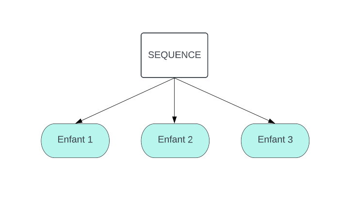

#Py Trees for ROS


##Séquence



La sequence va executer ses enfants un à un dans un ordre prédéfinit, si un enfant lui renvoi SUCCESS alors il passe à l'autre, si tous les enfant renvoient SUCESS alors il renvoi SUCCESS, si un enfants renvoient FAILURE alors il arrete la séquence et renvoi FAILURE

##Selector


{ align=left }

L'objetif ici est le suivant, dans un premeier temps nous allons verifier que nous avons pas deja un goal en attente, si c'est la cas on peut aller generer la trajectoire pour atteindre notre goal. En revanche si nous avons pas de goal present alors nous pouvons rester en attente de goal avant de poursuivre 

``` py    


##############################################################################
# Imports
##############################################################################

import functools
import py_trees
import py_trees_ros
import py_trees.console as console
import rospy
import sys

from geometry_msgs.msg import PoseStamped
import geometry_msgs.msg as geometry_msgs
import mbf_msgs.msg as mbf_msgs


##############################################################################
# Actions
##############################################################################


class GetPath(py_trees_ros.actions.ActionClient):

    def initialise(self):
    
        self.action_goal = mbf_msgs.GetPathGoal(target_pose=py_trees.blackboard.Blackboard().get("target_pose"))
        super(GetPath, self).initialise()

    def update(self):
   
        status = super(GetPath, self).update()
        if status == py_trees.Status.SUCCESS:
            py_trees.blackboard.Blackboard().set("path", self.action_client.get_result().path)
        return status


class ExePath(py_trees_ros.actions.ActionClient):

    def initialise(self):
  
        self.action_goal = mbf_msgs.ExePathGoal(path=py_trees.blackboard.Blackboard().get("path"))
        super(ExePath, self).initialise()


##############################################################################
# Behaviours
##############################################################################

def create_root():
    # Create all behaviours
    bt_root = py_trees.composites.Sequence("MBF BT Demo")
    get_goal = py_trees.composites.Selector("GetGoal")
    fallback = py_trees.composites.Selector("Fallback")
    navigate = py_trees.composites.Sequence("Navigate")
    new_goal = py_trees_ros.subscribers.ToBlackboard(name="NewGoal",
                                                     topic_name="/move_base_simple/goal",
                                                     topic_type=geometry_msgs.PoseStamped,
                                                     blackboard_variables = {'target_pose': None})

    
    have_goal = py_trees.blackboard.CheckBlackboardVariable(name="HaveGoal", variable_name="target_pose")
    clr_goal1 = py_trees.blackboard.ClearBlackboardVariable(name="ClearGoal", variable_name="target_pose")
    clr_goal2 = py_trees.blackboard.ClearBlackboardVariable(name="ClearGoal", variable_name="target_pose")


    get_path = GetPath(name="GetPath",
                       action_namespace="/move_base_flex/get_path",
                       action_spec=mbf_msgs.GetPathAction)

  
            
    exe_path = ExePath(name="ExePath",
                       action_namespace="/move_base_flex/exe_path",
                       action_spec=mbf_msgs.ExePathAction)


    

    # Compose tree
    bt_root.add_children([get_goal, fallback])
    get_goal.add_children([have_goal, new_goal])
    navigate.add_children([get_path, exe_path,clr_goal1])
    fallback.add_children([navigate,clr_goal2 ])

    return bt_root


def shutdown(behaviour_tree):
    behaviour_tree.interrupt()

if __name__ == '__main__':
    rospy.init_node("mbf_bt_demo")
    root = create_root()
    behaviour_tree = py_trees_ros.trees.BehaviourTree(root)
    rospy.on_shutdown(functools.partial(shutdown, behaviour_tree))
    if not behaviour_tree.setup(timeout=15):
        console.logerror("failed to setup the tree, aborting.")
        sys.exit(1)

    behaviour_tree.tick_tock(500)

```


niquzta elere
deded