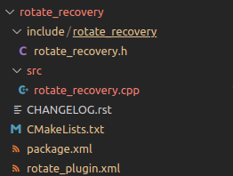

Le paquet move_base_flex de ROS utilise un système de plugins pour permettre la sélection de différents comportements de navigation en fonction des conditions du terrain et des capacités du robot.

Parmi les plugins disponibles, il y a un plugin de recovery qui est utilisé pour gérer les cas d'échec de navigation, tels que les blocages, les collisions et les erreurs de planification. Ce plugin est appelé lorsqu'un échec de navigation est détecté pour permettre au robot de se remettre sur la bonne voie et de continuer à atteindre son objectif.

Pour appeler le plugin de recovery, la fonction move_base_flex utilise la fonction ROS "recover" qui est définie dans le paquet move_base. Cette fonction est appelée lorsqu'un échec de navigation est détecté, et elle utilise la liste de plugins de recovery configurée pour sélectionner le plugin approprié à utiliser pour résoudre l'échec.

Le système de récupération de MBF est conçu pour être flexible et extensible, de sorte que de nouveaux comportements de récupération peuvent être facilement ajoutés ou modifiés pour répondre aux besoins de différents environnements de navigation.


La classe CostmapRecovery définit une interface pour les comportements de récupération utilisés dans la navigation. Elle hérite de la classe mbf_abstract_core::AbstractRecovery et doit être implémentée par tous plugins de récupération qui souhaite être utilisé dans le système de navigation MBF.


_La classe CostmapRecovery_


``` cpp   
#ifndef MBF_COSTMAP_CORE__COSTMAP_RECOVERY_H_
#define MBF_COSTMAP_CORE__COSTMAP_RECOVERY_H_


#include <mbf_abstract_core/abstract_recovery.h>
#include <costmap_2d/costmap_2d_ros.h>
#include <mbf_utility/types.h>


namespace mbf_costmap_core
{
/**
* @class CostmapRecovery
* @brief Provides an interface for recovery behaviors used in navigation.
* All recovery behaviors written to work as MBF plugins must adhere to this interface. Alternatively, this
* class can also operate as a wrapper for old API nav_corebased plugins, providing backward compatibility.
*/
class CostmapRecovery : public mbf_abstract_core::AbstractRecovery{
public:


 typedef boost::shared_ptr< ::mbf_costmap_core::CostmapRecovery> Ptr;


 /**
  * @brief Initialization function for the CostmapRecovery
  * @param tf A pointer to a transform listener
  * @param global_costmap A pointer to the global_costmap used by the navigation stack
  * @param local_costmap A pointer to the local_costmap used by the navigation stack
  */
 virtual void initialize(std::string name, TF* tf,
                         costmap_2d::Costmap2DROS* global_costmap,
                         costmap_2d::Costmap2DROS* local_costmap) = 0;


 /**
  * @brief Runs the CostmapRecovery
  * @param message The recovery behavior could set, the message should correspond to the return value
  * @return An outcome which will be hand over to the action result.
  */
 virtual uint32_t runBehavior(std::string& message) = 0;


 /**
  * @brief Requests the planner to cancel, e.g. if it takes too much time
  * @remark New on MBF API
  * @return True if a cancel has been successfully requested, false if not implemented.
  */
 virtual bool cancel() = 0;


 /**
  * @brief Virtual destructor for the interface
  */
 virtual ~CostmapRecovery(){}


protected:
 CostmapRecovery(){}


};
}  /* namespace mbf_costmap_core */


#endif /* MBF_COSTMAP_CORE__COSTMAP_RECOVERY_H_ */


``` 


La classe définit les méthodes virtuelles suivantes :

* **initialize** : fonction d'initialisation pour la récupération des coûts. Elle prend en entrée un nom, un pointeur sur un écouteur de transformation, un pointeur sur la carte de coûts globale utilisée par la pile de navigation et un pointeur sur la carte de coûts locale utilisée par la pile de navigation.

* **runBehavior** : Exécute la récupération des coûts. La fonction prend en entrée un message qui peut être défini par le comportement de récupération, le message doit correspondre à la valeur de retour. La fonction renvoie un code d'état qui sera transmis au résultat de l'action.

* **cancel** : demande au planificateur d'annuler, par exemple s'il prend trop de temps. La fonction retourne vrai si une annulation a été demandée avec succès, faux si elle n'est pas implémentée.

* **~CostmapRecovery** : destructeur virtuel pour l'interface.


Les classes qui implémentent cette interface doivent définir les méthodes initialize, runBehavior et éventuellement cancel. La classe CostmapRecovery fournit également un type de pointeur partagé pour faciliter la création d'instances de sous-classes.


Nous allons créer un plugin que appeler rotate_recovery 

Notre classe doit hériter de l’interface mbf_costmap_core::CostmapRecovery


``` cpp   
class RotateRecovery : public mbf_costmap_core::CostmapRecovery
``` 


Dans un premier temps on intégrer la library permettant d’exporter notre plugin

``` cpp   
#include <pluginlib/class_list_macros.h>
```


On exporte notre plugin et l’inteface mbf_costmap_core::CostmapRecovery:

``` cpp   
PLUGINLIB_EXPORT_CLASS(rotate_recovery::RotateRecovery, mbf_costmap_core::CostmapRecovery)
```


PLUGINLIB_EXPORT_CLASS est une macro utilisée par la bibliothèque pluginlib pour exporter une classe en tant que plugin pour qu'elle puisse être découverte et utilisée par d'autres applications. La macro permet de définir la classe (ici rotate_recovery::RotateRecovery) en tant que plugin avec une classe de base (ici mbf_costmap_core::CostmapRecovery). Cela signifie que les applications qui souhaitent utiliser ce plugin pouront le faire en s'attendant à une interface compatible avec la classe de base.


Notre classe doit donc contenir les methode suivante :

``` cpp
virtual void initialize(std::string name, tf2_ros::Buffer*,
                  costmap_2d::Costmap2DROS*, costmap_2d::Costmap2DROS* local_costmap);

virtual uint32_t runBehavior(std::string& message);
virtual bool cancel();

~RotateRecovery();
```


Nous devons également créer un fichier XML pour enregistrer un plugin de comportement de récupération dans la bibliothèque de plugins ROS. Le plugin est défini par la classe "rotate_recovery::RotateRecovery" qui hérite de la classe de base "mbf_costmap_core::CostmapRecovery". Le tag <library> spécifie le chemin de la bibliothèque dynamique "librotate_recovery" qui contient le plugin. Le tag <class> fournit des informations sur la classe, y compris son nom, son type et le type de sa classe de base. La description décrira brièvement ce que fait le comportement de récupération.

``` xml
<library path="lib/librotate_recovery">
  <class name="rotate_recovery/RotateRecovery" type="rotate_recovery::RotateRecovery" base_class_type="mbf_costmap_core::CostmapRecovery">
    <description>
      A recovery behavior that performs a 360 degree in-place rotation to attempt to clear out space.
    </description>
  </class>
</library>
```


Le pacquet du plugin doit ressembler à ca:





Dans le liens suivant le packet roate recovery complet:


[Rotate_recovery](https://github.com/TsakasAchille/ROS_Navigation)

