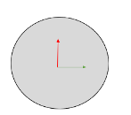

# Modèle


## Corps

Ci-dessous, les dimensions du corps du robot:


 


### Collision

On genere un rectangle correpondant au corps du robot:


L’origine du corps se trouve au centre du rectangle, on souhaite décaler cette origine pour la placer au niveau de l’entraxe des roues, on decale donc l’axe x de 0.2 m

Sur gazebo il est important de distingué deux paramètres de géométrie: Visual et colision. Une géometrie “collision” elle aura des paramètre physique et sera donc soumis au frottement, friction, gravité.. 
 
 
 
``` xml
<collision>

  <origin xyz="0.2 0 0.0" rpy="0 0 0"/>
  <geometry>
    <box size="0.6 0.420 0.115"/>
  </geometry>

</collision>
   
```


### Visuel


Une géometrie “visual” elle, sera purement visuel. Nous pouvons ajouter un mesh, un fichier 3D format STL que nous avons génerer avec un logicielle de CAO.
 
 
``` xml
<visual>
 
    <origin xyz="0.2 0 0.0" rpy="0 0 -1.57"/>
    <geometry>
        <mesh filename="package://rescue_description/meshes/base_link.stl" scale="0.001 0.001 0.001"/>
    </geometry>
    <material name="light_black"/>
 
</visual>

```
 
 
 
### Physique

 
Désormais nous devons definir l’inertie de notre pièce. Notre corps est un rectangle, pour faciliter la tâche, nous pouvons inclure une macro qui calcul la matrice d’inertie d’un rectangle en fonction de sa masse et ses dimension. On y ajoute egalement l’origine du corp.
 
 
 
 
 
``` xml

 <xacro:macro name="box_inertia" params="m w h d x y z">
   <inertial>
        <origin  xyz="${x} ${y} ${z}"  rpy="${pi/2} 0 ${pi/2}"/>     
        <mass value="${m}"/>
    <inertia ixx="${(m/12) * (h*h + d*d)}" ixy="0.0" ixz="0.0" iyy="${(m/12) * (w*w + d*d)}" iyz="0.0" izz="${(m/12) * (w*w + h*h)}"/>

   </inertial>

 </xacro:macro>
 
```
 
 
 
 
 
 
Nous pouvons appeler la macro dans la definiton du corps
 
 
``` xml
 
<xacro:box_inertia m="1O" w="0.420" d="0.6" h="0.115" x="0.2" y="0" z="0" />
 
```
 


## Roue

Les roues peuvent être representer comme des cylindres. voici leur dimensions:


On créer un link que l’on appelle Roue_Droite
``` xml
<link name="Roue_Droite">
```

On genère un cylindre avec les bonnes dimensions
``` xml
<cylinder length="0.0375" radius="0.050"/>        
```

On place l’origine de la pièce en son centre: 

``` xml
<origin xyz=" 0 0 0" rpy="0 0 0"/>
```



Pour l'assembler au corps, nous devons créer le joint entre la roue droite et le corps du robot. 

``` xml
<joint name="Joint_Roue_Droite" type="continuous">
```

Le joint est de type "continuous” pour indiquer une rotation autour d’un axe unique

On definit les lien de parenté:

``` xml
<parent link="base_link"/>
<child link="Roue_Droite"/>
```

	


on definit l’origine du joint


Cette origine est la distance entre les origines du link père et mère en prenant comme origne fixe celle du père
On Sohaite décaler la roue par rapport à l'origine du corps:

``` xml
 <origin xyz="0 -0.21 -0.065" rpy="0 0 0"/>
```


On remarque que la roue n’est pas orienté correctement, il est necessaire de réaliser une rotation de 90° autour de l’axe x


rotation de 90° = π/2 = 1.57  autour de l’axe x et decalage en y (epaisseur de la roue):
``` xml
 <origin xyz="0 -0.2285 -0.065" rpy="-1.57 0 0"/>
```

Enfin , on definit l’axe de rotation de notre roue, ici, l’axe z
``` xml
 <axis xyz="0 0 1"/>
```


		


## Footprint

Le footprint du robot definit l’empreinte du robot dans l’espace. Ce paramètre permet aux algorithme de navigation de connaitre les dimensions du robot.
La délimitation se définit en 4 point A,B,C,D

``` yml
 footprint: [[A], [B], [C], [D]]
```


Nous devons choisir des points qui permettent de couvrir l’integralité de l'espace pris par le robot
L’origine se base par rapport au base_link definit précédemment.
Dans l’exemple ci-dessous nous avons representé les 4 points correspondant aux angle du corps du robot


Le footprint correspondant est le suivant:
``` yml
footprint: [[-0.1,-0.21], [-0.1,0.21], [0.5,0.21], [0.5,-0.21]]
```

Pour couvrir le robot et ajouter une zone securité nous allons utiliseé un footprint légèrement plus grand:

``` yml
footprint: [[-0.12,-0.23], [-0.12,0.23], [0.52,0.23], [0.52,-0.23]]
```
# 
#
#
#
#
#
#
#

# Assemblage complet


De la même manière que pour les roues et le corps on ajoute a notre modele, les flipper, une roues libre, le lidar et la caméra

toue les joints sont des joint fixes enfant du link corps

### arborescence

- corps
    - roue_droite
    - roue_gauche
    - flipper_droit
    - flipper_gauche
    - roue_libre
    - caméra
    - lidar


Dans le lien github suivant le modèle complet

 [GitHub](https://github.com/TsakasAchille/ROS_Navigation.git
)


